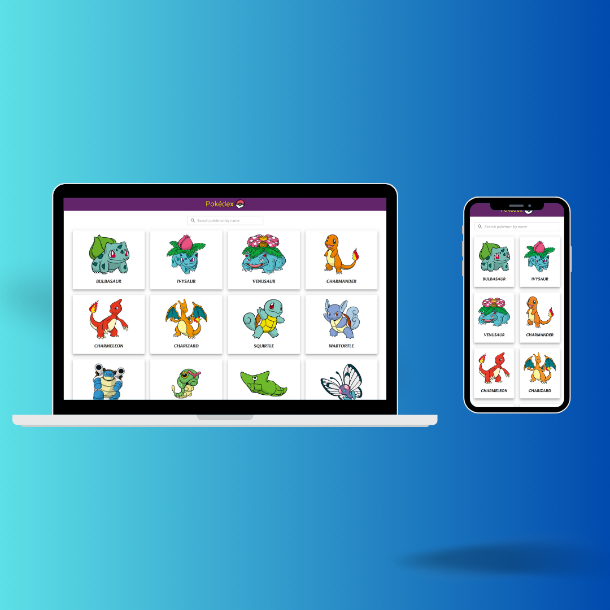

<h1 align="center">Pokédex</h1>
<div align="center">


</div>

<p align="center" width="100%">

</p>

## 📝 Table of Contents

- [About](#about)
- [Getting Started](#getting_started)
- [Built Using](#built_using)
- [Authors](#authors)

## 🧐 About <a name = "about"></a>

⚡️ A list of pokémons with a fuzzy search feature is displayed on the home page.\
⚡️ User can view more details by clicking on the particular pokémon.\
⚡️ It is fully responsive & user friendly website.\
⚡️ The design features some animations and hover effects.

## 🏁 Getting Started <a name = "getting_started"></a>

These instructions will get you a copy of the project up and running on your local machine for development and testing purposes.

### **Prerequisites** :

Make sure you have installed all of the following prerequisites on your machine:

- Git - [Download & Install Git](https://git-scm.com/downloads), OSX and Linux machines typically have this already installed.
- Node.js - [Download & Install Node.js](https://nodejs.org/en/download/) with the npm package manager.
- Recommended Versions of them are -

  ```
  node v16.20.2 or higher
  npm v8.19.4 or higher
  git v2.30.1 or higher
  ```

### **Starting React Dev Server** :

1. Download or clone the code from this repository. If you download as a zip file, be sure to unzip it.

2. Navigate to the My-Portfolio folder, there should be a package.json file in this folder.

3. In a command window (or the Command prompt in VS Code), type below command.

   ```
   npm install
   ```

   This creates a **node_modules** folder and installs all packages from the package.json file into that folder. You may see a few warnings during this process, but you should not see any errors.

4. In the same command window (or the Command prompt in VS Code), type

   ```
   npm run dev
   ```

   The application should then run successfully and you should see a message like **" VITE v4.x.x ready in xxx ms Local: http://localhost:5173/"**.

5. Open **http://localhost:5173** to view it in the browser.

## ⛏️ Built Using <a name = "built_using"></a>

- [Vite](https://vitejs.dev/) - a build tool for front-end
- [React](https://react.dev/) - User Interface (UI) library
- [Typescript](https://www.typescriptlang.org/) - Strongly typed programming language
- [Material UI](https://mui.com/material-ui/) - React UI component library
- [Axios](https://axios-http.com/) - a simple promise based HTTP client for the browser
- [React Query](https://tanstack.com/query/v3/docs/framework/react/overview) - Powerful asynchronous state management library
- [fuse.js](https://www.fusejs.io/) - Powerful, lightweight fuzzy-search library, with zero dependencies

## ✍️ Authors <a name = "authors"></a>

- [@Nilkanth-Patadiya](https://github.com/Nilkanth-Patadiya) - Idea & Implementation
